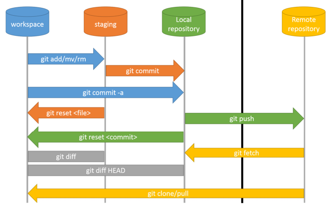

```{r setup, include=FALSE}
library(learnr)
library(tidyverse)
```

## Overview

You have used GitHub all term to get assignments and submit projects. Today: what is actually going on underneath.

* **Why** version control exists
* **Core model**: repository, commits, the staging area
* **Everyday loop**: edit, stage, commit
* **Remotes**: `push`, `pull`, GitHub, authentication
* **Branches** and **pull requests**
* **Inspecting** and **undoing** changes

## The problem: `final_v3_REALLY_final.R`

Without version control, "tracking changes" means copying files:

```
analysis.R
analysis_v2.R
analysis_FINAL.R
analysis_FINAL_fixed.R
analysis_FINAL_fixed_USE_THIS_ONE.R
```

Questions you can't easily answer:

* What changed between two versions, and *why*?
* It worked last Tuesday -- can I get *that* version back?
* Two of us edited the same file. How do we combine our work?

**Version control** answers all of these. The standard tool is **Git**.

## What Git gives you

First analogy: **Google Docs "track changes"**, for a whole project of files.

* **History** -- labeled timeline of every saved change: who, when, *why*
* **Undo** -- return any file (or the whole project) to any past state
* **Collaboration** -- many people edit and merge work systematically
* **Backup + portability** -- with GitHub, work lives off your laptop

Git vs. GitHub:

* **Git** = the *tool* (runs on your machine)
* **GitHub** = a *website* that hosts Git repos for sharing (GitLab, Bitbucket are alternatives)

## The repository

A **repository** ("repo") = a project folder Git is tracking.

```{bash, eval = FALSE}
git init                                   # start tracking the current folder
git clone https://github.com/user/repo.git # copy an existing repo from GitHub
```

* History lives in a hidden `.git` subfolder
* Your files look completely normal -- Git just remembers their history

## Tell Git who you are

* Done **once per machine**
* Stamps every commit with your identity

```{bash, eval = FALSE}
git config --global user.name "Your Name"
git config --global user.email "you@umich.edu"
```

## Commits: snapshots with a message

The fundamental unit is the **commit**.

* A labeled **snapshot** of the whole project at one moment
* Plus a short **message** describing the change
* Like **save points** in a game -- the history is a chain of them

Good commits:

* **Small and focused**: "Add bootstrap CI to analysis"
* Not a grab-bag: ~~"stuff"~~
* Good messages make the history actually useful later

## The staging area

Git does **not** auto-commit every change. You choose what goes in.

```
working directory  --git add-->  staging area  --git commit-->  history
   (your edits)                  (next snapshot)                 (saved)
```

* The **staging area** (the "index") sits between edits and a commit
* Lets you group related changes into one clean commit
* `git status` shows where everything stands

## A picture of the workflow



* `add` -- working directory → staging area
* `commit` -- staging area → local history
* `push` -- local history → shared (remote) repo
* `pull` -- remote → local (others' changes come back)

## The everyday loop

```{bash, eval = FALSE}
git status              # what have I changed?
git add analysis.R      # stage the file(s)
git commit -m "Add bootstrap confidence interval"   # snapshot + message
git log --oneline       # compact list of past commits
```

The whole local workflow: **edit → `add` → `commit` → repeat.**

## Seeing what changed: `git diff`

Before committing, check exactly what you changed.

```{bash, eval = FALSE}
git diff                # unstaged changes (working dir vs. last commit)
git diff --staged       # what is staged for the next commit
```

* Lines starting with `+` were added, `-` were removed
* Habit: `diff` before you `add`, `add` before you `commit`

## Hands-on exercise

Open the **Terminal** tab in RStudio. Goal: practice putting *two* files into
*separate* commits.

1. `git init`, then set `user.name` and `user.email`
2. Create two files:
   `echo "todo" > notes.txt` and `echo "x <- 1" > code.R`
3. Run `git status`. How many **untracked** files does Git report?
4. Stage and commit **only** `notes.txt` -- leave `code.R` alone
5. Run `git status` again. What is the state of `code.R` now?
6. Commit `code.R` in a second commit, then `git log --oneline`

Why might you want two commits here instead of one?

## Remotes: syncing with GitHub

A **remote** = a copy of the repo elsewhere (almost always GitHub).

```{bash, eval = FALSE}
git push    # send local commits up to GitHub
git pull    # bring others' (or your own) commits down
```

Healthy rhythm when collaborating:

* **`pull`** before you start (get the latest)
* do your work and **`commit`**
* **`push`** to share

This is exactly the flow you used to submit projects.

## Authenticating with GitHub

GitHub needs to know it's really you before accepting a `push`.

* Passwords over HTTPS are **no longer accepted**
* Two common options:
  * **Personal Access Token (PAT)** -- a long generated password; in R, `usethis::create_github_token()` helps
  * **SSH key** -- a key pair stored on your machine
* Set up **once per machine**; then `push`/`pull` "just work"

## `.gitignore`: what *not* to track

Some files don't belong in version control.

* Rendered output: `*.pdf`, `*.html`
* Large data, secrets/passwords, editor junk (`.DS_Store`)

```
*.pdf
*.html
.DS_Store
data/raw_huge.csv
secrets.R
```

This is why homework repos track the blank `.Rmd` and data but **gitignore** the rendered PDFs.

## Exercise: oops, a secret

You just committed and **pushed** a file `keys.R` containing your API password.

1. What do you add, and to which file, so Git stops tracking files like this
   going forward?
2. Why is "just delete the file in a new commit" **not** enough to keep the
   password safe? (Think about where the history lives.)

## Branches: parallel lines of work

A **branch** = an independent line of development.

```{bash, eval = FALSE}
git switch -c new-feature   # create and move to a new branch
# ...edit, add, commit here...
git switch main             # main is untouched
```

* Try a feature without disturbing `main`
* **Merge** back into `main` when ready
* Two people → two branches → no overwriting each other

Same idea as the homework `main`/`solutions` workflow: solutions live on their own branch.

## Exercise: will it conflict?

Two teammates both `pull` the latest `main`, then each makes their own branch:

* **Avni** edits the title in `report.Rmd`
* **Ben** edits a function in `clean.R`

Both commit, push, and merge their branches back into `main`.

1. Will Git report a **merge conflict**? Why or why not?
2. Now suppose they had **both** edited the title line in `report.Rmd`.
   What changes, and who decides the final wording?

## Collaborating with pull requests

On GitHub, the standard way to merge a branch is a **pull request** (PR).

* "Here are my commits -- please review and merge into `main`"
* A place to **review**, discuss, and run automated checks
* Nothing reaches `main` without a look first

This is how teams keep a shared codebase healthy.

## Merge conflicts

Two people change the **same lines** → Git can't guess who's right.

```
<<<<<<< HEAD
mean_hwy <- mean(mpg$hwy)
=======
mean_hwy <- mean(mpg$hwy, na.rm = TRUE)
>>>>>>> their-branch
```

To resolve:

1. Edit the file to the version you want
2. Delete the `<<<<`, `====`, `>>>>` markers
3. `add` and `commit`

Routine, not scary. Commit small and pull often → conflicts stay rare and small.

## Exercise: resolve a conflict

You pull and find this in `summary.R`:

```
total <- sum(values)
<<<<<<< HEAD
avg <- mean(values)
=======
avg <- mean(values, na.rm = TRUE)
>>>>>>> teammate
print(avg)
```

The data has missing values, so dropping `NA`s is correct.

1. Write the **exact lines** the file should contain after you resolve it.
2. What two Git commands do you run *after* editing to finish the merge?

## Undoing things

Git's superpower is that mistakes are recoverable.

```{bash, eval = FALSE}
git restore analysis.R          # discard unstaged edits to a file
git restore --staged analysis.R # unstage (keep the edits)
git revert <commit>             # new commit that undoes an old one
```

* `restore` -- throw away changes since the last commit
* `revert` -- safely undo a *committed* change with a new commit
* Because everything is committed, you can almost always get back

## Exercise: which command?

Match each goal to the single best command. (No peeking at the slides.)

| You want to... | Command? |
|---|---|
| See what teammates pushed since you last worked | ? |
| See what you changed before you stage it | ? |
| Throw away uncommitted edits to one file | ? |
| Undo a commit you already pushed last week | ? |
| Send your finished commits to GitHub | ? |

Choices: `git diff`, `git pull`, `git push`, `git restore <file>`,
`git revert <commit>`.

## A worked collaboration cycle

A typical day on a shared project:

```{bash, eval = FALSE}
git pull                          # 1. get the latest
git switch -c add-summary-table   # 2. branch for your feature
# ...edit files...
git add report.Rmd                # 3. stage
git commit -m "Add summary table" # 4. commit
git push -u origin add-summary-table  # 5. push the branch
# 6. open a Pull Request on GitHub for review
```

## Summary

* **Version control** replaces `_final_v3` copies with a real, searchable, shareable history
* A **repo** holds the project; a **commit** is a snapshot + message; the **staging area** picks what each commit contains
* Everyday loop: **edit → `add` → `commit`**; **`push`/`pull`** sync with a remote
* **Branches** enable parallel work; **pull requests** let collaborators review before merging
* `git diff`, `git restore`, and `git revert` let you inspect and undo
* `.gitignore` keeps generated files, big data, and secrets out

The definitive friendly guide for our context:
[Happy Git and GitHub for the useR](https://happygitwithr.com/).
